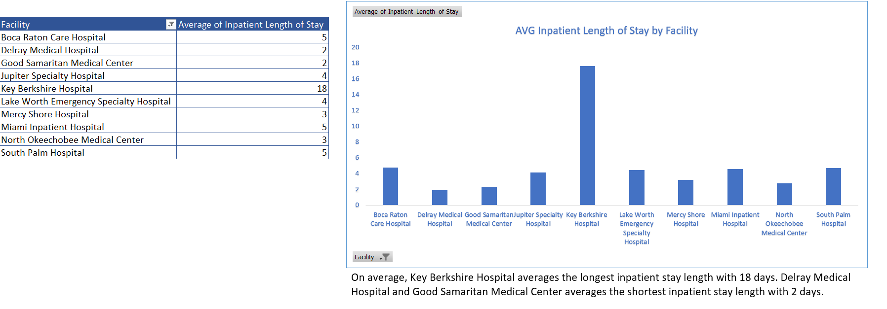
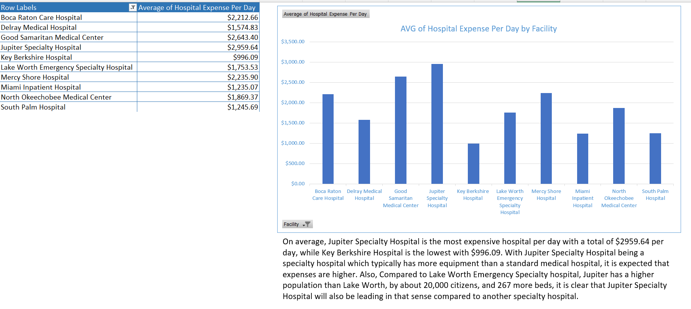
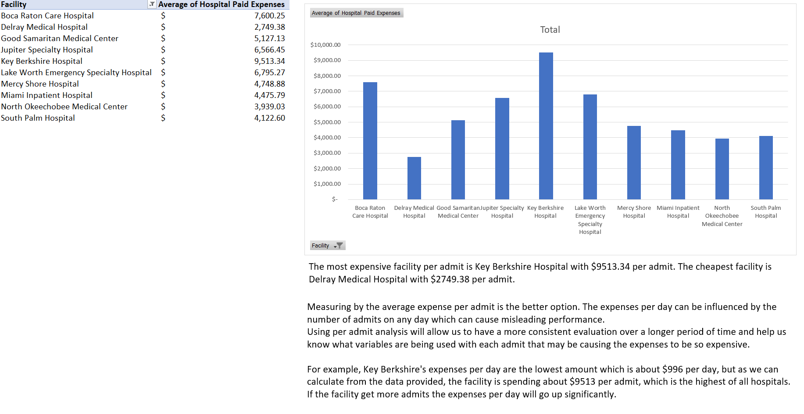
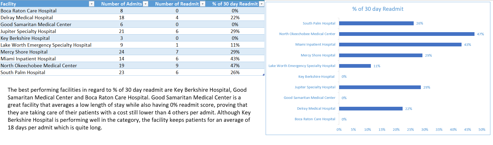
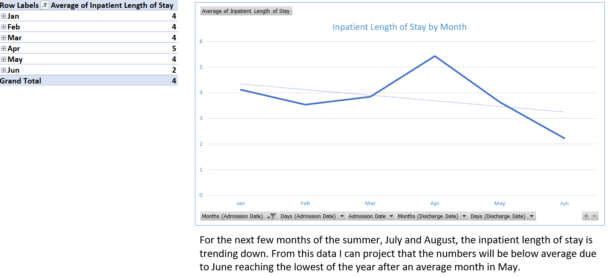
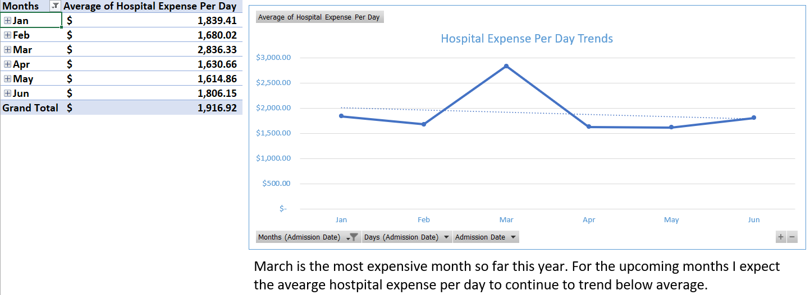

# Healthcare-Analysis-Project

# Excel Analytics Project – Inpatient Cost & Trend Analysis

**Author**: John Carter  
**Tools Used**: Microsoft Excel (PivotTables, Charts, Conditional Formatting)

## Overview
This Excel project analyzes key hospital inpatient metrics across multiple categories using dashboards, visualizations, and calculated insights. The analysis focuses on understanding healthcare cost patterns, inpatient care duration, and hospital performance across South Florida hospitals.

This mimics a real-world healthcare analyst scenario with real-world data, where multiple KPI reports and trends are required for executive-level insights.

## Analyses Performed

1. **Average Inpatient Length of Stay**
   - Summary of patient stay legnth per admit
   - 
2. **Average Hospital Expenses Per Day**
   - Daily cost analysis per hospital stay
   - 
3. **Average Hospital Expenses Per Admit**
   - Cost analysis per admit

4. **30-Day Readmission Percentage Comparisons**
   - Comparison of facilities based on readmission rates
   - 
5. **Average Inpatient Length of Stay – Trend Over Time**
   - Multi-year trend visualization and breakdown
   - 
6. **Average Hospital Expenses Per Day – Trend Over Time**
   - Year-over-year comparison of hospital costs
   - 
## 🚀 How to Use

1. **Download** the Excel file:  
   [Download Excel File]()

2. Open in **Excel** (desktop version recommended)

3. Use slicers and filters to explore data.

## Skills Demonstrated

- Advanced **Pivot Tables** for multi-category summaries
- **Interactive Dashboards** with slicers by year, state, and provider
- **Line & Bar Charts** to display trends
- **Conditional Formatting** to highlight high/low performers
- **Formulas & Calculations** (e.g., AVERAGEIF, percent change)
- **Clean and Organized Layout** for readability and user navigation

## Contact

**John Carter**  
Email: [johncarterecom@gmail.com](mailto:johncarterecom@gmail.com)  
Location: Winston-Salem, NC

---

> *This project was created as a term assignment to demonstrate real-world Excel data analysis skills.*

Excel project using Pivot Tables and VLookup
